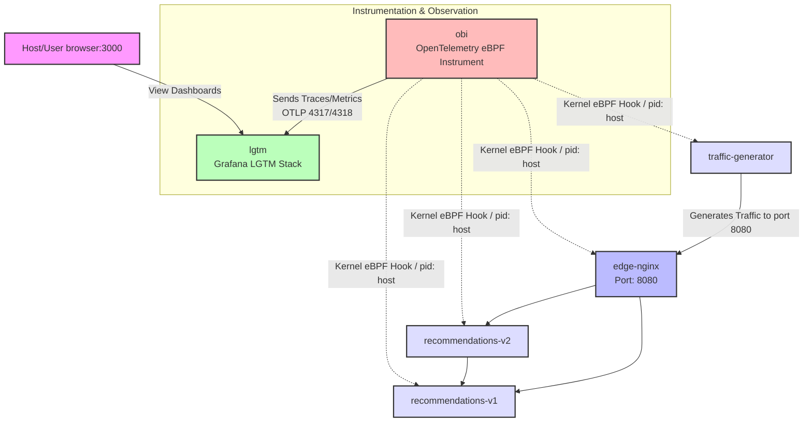

# openinfra-monitoreo-alto-rendimiento-ebpf
Monitoreo de alto rendimiento con BPF para servidores saturados

## diagrama de referencia

```mermaid
graph TD
    %% Styling
    classDef external fill:#f9f,stroke:#333,stroke-width:2px;
    classDef proxy fill:#bbf,stroke:#333,stroke-width:2px;
    classDef app fill:#ddf,stroke:#333,stroke-width:2px;
    classDef tel fill:#fbb,stroke:#333,stroke-width:2px;
    classDef monitor fill:#bfb,stroke:#333,stroke-width:2px;

    %% Elements
    User[Host/User browser:3000]:::external
    TG[traffic-generator]:::app
    Edge[edge-nginx<br/>Port: 8080]:::proxy
    V1[recommendations-v1]:::app
    V2[recommendations-v2]:::app
    
    subgraph Instrumentation & Observation
        OBI[obi<br/>OpenTelemetry eBPF Instrument]:::tel
        LGTM[lgtm<br/>Grafana LGTM Stack]:::monitor
    end

    %% Network / HTTP Traffic Flow
    TG -->|Generates Traffic to port 8080| Edge
    Edge --> V1
    Edge --> V2
    V2 --> V1

    %% eBPF Kernel Tracing (Non-intrusive)
    OBI -.->|Kernel eBPF Hook / pid: host| Edge
    OBI -.->|Kernel eBPF Hook / pid: host| V1
    OBI -.->|Kernel eBPF Hook / pid: host| V2
    OBI -.->|Kernel eBPF Hook / pid: host| TG

    %% Telemetry Pipeline
    OBI -->|Sends Traces/Metrics<br/>OTLP 4317/4318| LGTM
    User -->|View Dashboards| LGTM
```

